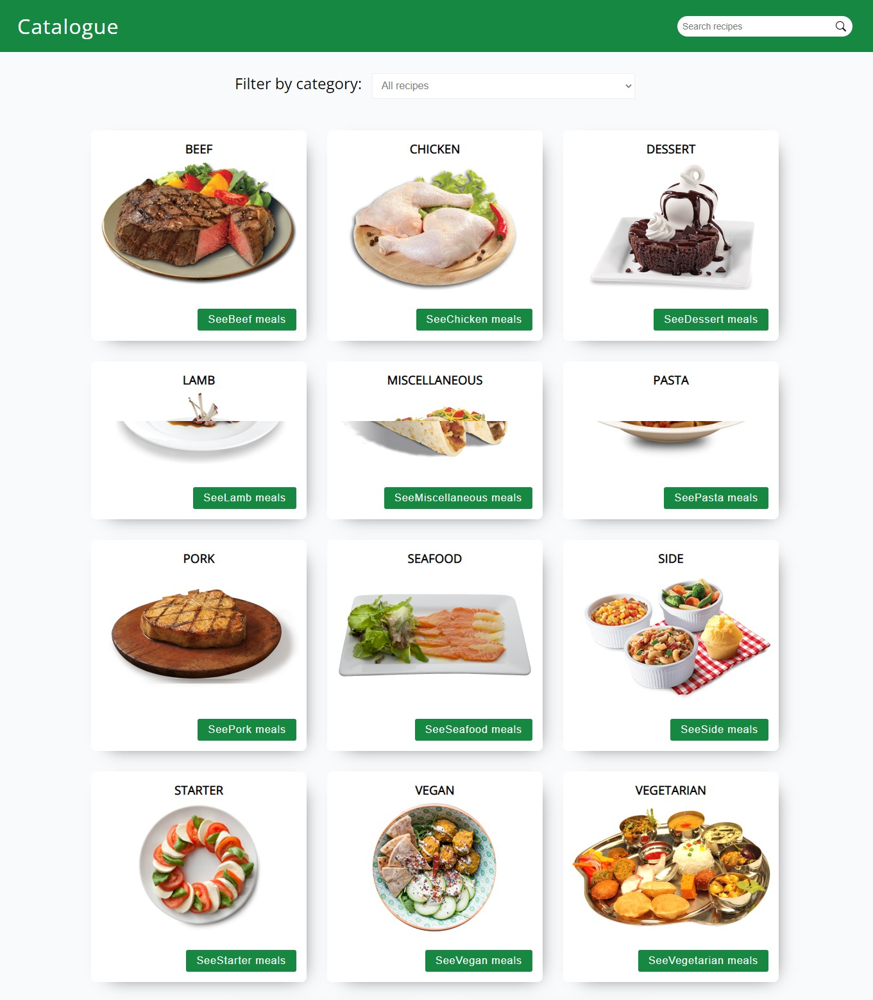
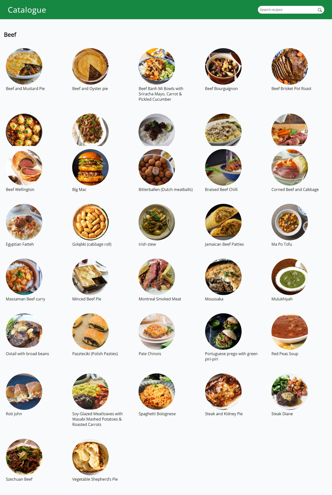

# Recipe Catalogue
## About
Recipe Catalogue is a single-page React application built using React and Redux for managing the state of the application. The Application fetches data from themealdb recipe API. The Application is also able to filter the recipes based on the categories of the recipes. It can also display all the recipes and meals which belong to a given category of recipes.

## Below are screenshots of the App

### Screenshot of the home page


### Screenshot of the meals page


## Built With

- HTML
- CSS
- Webpack
- npm
- React.js
- Redux
- themealdb recipe API

## Live Demo

[Live Demo Link](https://determined-swirles-43cdbf.netlify.app/)

## prerequisite
You must have a live internet connection before you get started.

## Getting started
To get started:

### Clone the repo: 
```
$ git clone https://github.com/gango-anan/recipe-catalogue.git

```

## Setup and run the application
### Install node.js:
```
First install node.js
```
### Next, navigate to the project folder and install other dependencies using the following command:
```
$ npm install
```
### Run the test suite to verify that everything is working correctly:
```
$ npm test
```
### If the test suite passes, launch the web server using the following command:
```
$ npm start
```
### Finally you can launch the application in your browser URL tab, by typing:
```
localhost:3000
```

## Author

Galiwango Ananiya

- GitHub: [@gango-anan](https://github.com/gango-anan) 
- Twitter: [@gango_anan](https://twitter.com/gango_anan) 
- LinkedIn: [@galiwango-ananiya](https://www.linkedin.com/in/galiwango-ananiya/) 

## 🤝 Contributing

Contributions, issues, and feature requests are welcome!

Feel free to check the [issues page](https://github.com/gango-anan/recipe-catalogue/issues).

## Show your support

Give a ⭐️ if you like this project!

## Acknowledgments
- Odin Project

## 📝 License

This project is [MIT](https://github.com/gango-anan/recipe-catalogue/blob/app-features/LICENSE) licensed.
